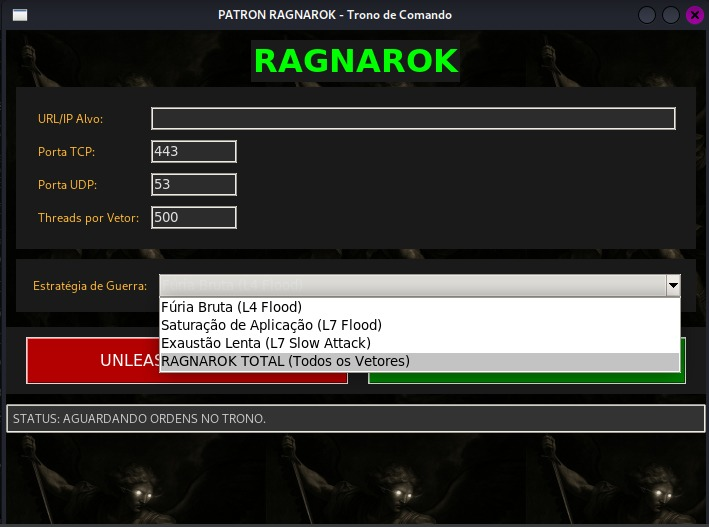

# 🛡️ PATRON_RAGNAROK

Ferramenta De DoS feita para ser pratica e facil de compreenção para iniciantes e insusiastas da area de denial of service.

---

## ⚙️ Instalação

```bash
git clone https://github.com/x34-ELPATRON/PATRON_RAGNAROK.git
cd PATRON_RAGNAROK
sudo python3 patron_ragnarok.py
```

---

## 🧠 Sobre o Projeto 

```text
🧠 SOBRE O PROJETO
O PATRON_RAGNAROK foi desenvolvido com foco em modularidade e eficiência.
Cada módulo representa uma técnica específica que pode ser combinada para simular cenários reais de ataque em ambientes de teste.

- Modular e expansível
- Alta performance em automação
- Foco em ambientes controlados e éticos

🖥️ INTERFACE
A interface do PATRON_RAGNAROK é baseada em terminal, com menus interativos e navegação intuitiva.
O usuário pode selecionar módulos, configurar threads.
Tudo foi pensado para facilitar o uso sem comprometer a flexibilidade.
```



```text
📢 AVISO LEGAL
Este projeto é distribuído apenas para fins educacionais e de pesquisa.
O uso indevido da ferramenta é de responsabilidade exclusiva do usuário.
Não nos responsabilizamos por qualquer dano causado.

📬 CONTATO
Discord: elpatron0x7
GitHub: https://github.com/x34-ELPATRON

